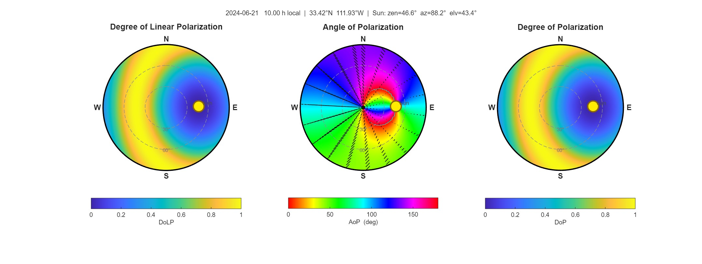

# Sky Polarization Simulator — Technical White Paper

**A full-sky Rayleigh scattering polarization model with MATLAB and Python implementations**

---
Author: Jiawei Zuo
Contact Info: jzuo@krakenoptix.com

## Abstract

This white paper describes a physics-based simulator that computes and visualizes the polarization pattern of the daytime sky as a function of geographic location (latitude, longitude, altitude), date, and local clock time. The model implements single Rayleigh scattering of unpolarized sunlight by sub-wavelength atmospheric aerosol particles, expressed in the Mueller-matrix (Stokes-vector) formalism. The solar position is derived from a standard astronomical algorithm using solar declination, the equation of time, and the local solar hour angle. 
The output is a full-sky map of the degree of linear polarization (DoLP), the angle of polarization (AoP), the degree of polarization (DoP), and the normalized Stokes parameters $Q$ and $U$, sampled on a regular zenith/azimuth grid. 
Two reference implementations are provided: 
1. A MATLAB toolbox with a six-file modular API
2. Python port that includes an interactive tkinter GUI with side-by-side 2D fisheye and 3D hemisphere visualizations.
   
This white paper describes the fundamental physics, the sign conventions, the software architecture, the API, and the limitations of the model.

---

## 1. Introduction

The polarization of skylight was first quantitatively described by Lord Rayleigh in 1871 as a consequence of the elastic scattering of sunlight by molecules and small particles in the Earth's atmosphere. For particles whose radius $r$ is much smaller than the wavelength $\lambda$ of incident light (the *Rayleigh regime*, $r \lesssim \lambda/10$), the scattered intensity varies as $\lambda^{-4}$ — the physical origin of the blue sky — and the scattered light becomes partially linearly polarized, with the strongest polarization observed perpendicular to the solar direction.

Polarization pattern of the sky is exploited by several insect species (notably honeybees and desert ants) as a celestial compass; it is the basis of recent bio-inspired *polarization-based navigation* systems for autonomous platforms in GNSS-denied environments; and it provides a clean test case for radiative-transfer codes used in atmospheric remote sensing. (buzzzzzzzzzzzzz, cheers !)

The simulator described here computes the **single-scattering** sky polarization for an arbitrary observer/time pair. It is intended for:

- Teaching the connection between solar geometry, scattering geometry, and Stokes-vector algebra.
- Generating synthetic ground-truth polarization maps for bio-inspired navigation experiments.
- Forward-modelling baseline (multiple-scattering-free) polarization for sensor calibration.

Multiple-scattering, aerosol-loading effects, and ground-reflection contributions are deliberately omitted; the model is the cleanest possible reduction of the underlying physics and converges to the observed sky pattern in clear, low-aerosol-load conditions away from the neutral points (Babinet, Brewster, Arago).

---

## 2. Physical Model

### 2.1 Stokes vectors and the Mueller-matrix formalism

A quasi-monochromatic plane-wave radiation field is represented by the 4-element Stokes vector

$$
\mathbf{S} = \begin{bmatrix} I \\\\ Q \\\\ U \\\\ V \end{bmatrix},
$$

where $I$ is the total intensity, $Q$ and $U$ encode linear polarization, and $V$ encodes circular polarization. Unpolarized sunlight is

$$
\mathbf{S}_{\text{sun}} = \begin{bmatrix} I_0 \\\\ 0 \\\\ 0 \\\\ 0 \end{bmatrix}.
$$

A linear scattering event acts as a multiplicative $4 \times 4$ *Mueller matrix*. For a single scattering by a Rayleigh-regime particle, the full transformation from incident sun-frame to observer-frame (local meridian plane) takes the form

$$
\mathbf{S}_{\text{out}} = \mathbf{L}(\sigma_S) \cdot \mathbf{F}_{\text{Rayl}}(\mu) \cdot \mathbf{L}(\sigma) \cdot \mathbf{S}_{\text{in}},
$$

where:

- $\mathbf{L}(\sigma)$ rotates the Stokes frame from the local meridian plane at the source to the scattering plane (the plane containing the incident and scattered ray).
- $\mathbf{F}_{\text{Rayl}}(\mu)$ is the Rayleigh scattering matrix in the scattering plane, parameterized by the scattering angle $\mu$.
- $\mathbf{L}(\sigma_S)$ rotates from the scattering plane back to the local meridian plane at the scattered direction (the sky point seen by the observer).

A critical simplification arises from the unpolarized input:

$$
\mathbf{L}(\sigma) \cdot \mathbf{S}_{\text{in}} = \mathbf{S}_{\text{in}},
$$

because rotation does not alter unpolarized light. Therefore only the rotation $\mathbf{L}(\sigma_S)$ matters, and the implementation needs to compute exactly one rotation angle per sky point.

### 2.2 The Rayleigh scattering matrix

For an isotropic Rayleigh scatterer the scattering matrix is

$$
\mathbf{F}_{\text{Rayl}}(\mu) =
\begin{bmatrix}
F_{11} & F_{12} & 0 & 0 \\\\
F_{12} & F_{11} & 0 & 0 \\\\
0 & 0 & F_{33} & 0 \\\\
0 & 0 & 0 & F_{33}
\end{bmatrix},
$$

with

$$
F_{11}(\mu) = \frac{1 + \cos^{2} \mu}{2}, \qquad
F_{12}(\mu) = -\frac{1 - \cos^{2} \mu}{2} = -\frac{\sin^{2} \mu}{2} \le 0, \qquad
F_{33}(\mu) = \cos \mu.
$$

Applied to unpolarized input, the in-scattering-plane Stokes vector is

$$
\mathbf{F}_{\text{Rayl}} \cdot \mathbf{S}_{\text{in}} = \begin{bmatrix} F_{11} I \\\\ F_{12} I \\\\ 0 \\\\ 0 \end{bmatrix}.
$$

After the rotation $\mathbf{L}(\sigma_S)$, the normalized scattered Stokes components in the observer's local meridian frame become

$$
\begin{aligned}
I_{\text{out}} &= 1 \\\\
Q_{\text{out}} &= \cos(2 \sigma_S) \cdot \frac{F_{12}}{F_{11}} \\\\
U_{\text{out}} &= -\sin(2 \sigma_S) \cdot \frac{F_{12}}{F_{11}} \\\\
V_{\text{out}} &= 0
\end{aligned}
$$

(Rayleigh scattering preserves $V = 0$.) The ratio $F_{12} / F_{11}$ simplifies to

$$
\frac{F_{12}}{F_{11}} = -\frac{\sin^{2} \mu}{1 + \cos^{2} \mu} \in [-1, 0],
$$

and the degree of linear polarization is its absolute value:

$$
\mathrm{DoLP}(\mu) = \left| \frac{F_{12}}{F_{11}} \right| = \frac{\sin^{2} \mu}{1 + \cos^{2} \mu}.
$$

DoLP reaches a maximum of $1.0$ at $\mu = 90^{\circ}$ and drops to $0$ at the sun ($\mu = 0^{\circ}$) and anti-sun ($\mu = 180^{\circ}$) directions. Real skies cap out near $\mathrm{DoLP} \approx 0.75$ to $0.85$ because of multiple scattering, but the *pattern* — a great circle of maximum polarization perpendicular to the sun direction — is faithfully reproduced by the single-scatter model.

### 2.3 Scattering angle on the celestial sphere

For an observer at the origin of a local East-North-Up coordinate system, let $(\theta_{\odot}, \varphi_{\odot})$ be the sun's zenith and azimuth and $(\theta_S, \varphi_S)$ be the zenith and azimuth of the sky point. The scattering angle $\mu$ is the angle between the unit vectors pointing to the sun and to the sky point, and is given by the spherical law of cosines:

$$
\cos \mu = \sin \theta_{\odot} \cdot \sin \theta_S \cdot \cos(\varphi_S - \varphi_{\odot}) + \cos \theta_{\odot} \cdot \cos \theta_S.
$$

This is evaluated at every grid point in `computeRayleighSkyMap.m` and `compute_rayleigh_sky_map` in the Python port. The result is clamped to $[-1, 1]$ before $\arccos$ to guard against rounding overshoot.

### 2.4 The rotation angle $\sigma_S$

$\sigma_S$ is the angle by which the Stokes reference frame at the scattered direction must be rotated to transform from the scattering plane to the local meridian plane. It is obtained from a second application of the spherical law of cosines (now in the spherical triangle whose vertices are the zenith, the sun direction, and the sky point):

$$
\cos \sigma_S = \frac{\cos \theta_{\odot} - \cos \theta_S \cdot \cos \mu}{\sin \mu \cdot \sin \theta_S}.
$$

Because $\arccos$ returns only the principal value in $[0^{\circ}, 180^{\circ}]$, the correct quadrant of $\sigma_S \in [0^{\circ}, 360^{\circ})$ must be selected from the azimuth difference $\Delta \varphi = \varphi_S - \varphi_{\odot}$:

$$
\sigma_S =
\begin{cases}
180^{\circ} + \arccos(\cos \sigma_S), & \Delta \varphi \in [0^{\circ}, 180^{\circ}] \quad \text{(Case A)} \\\\
360^{\circ} - \arccos(\cos \sigma_S), & \text{otherwise} \quad \text{(Case B)}
\end{cases}
$$

Several geometrically degenerate cases must be handled separately, all in `computeSigmaS.m` / `compute_sigma_s`:

| Condition | Treatment |
|---|---|
| $\mu \approx 0^{\circ}$ or $\mu \approx 180^{\circ}$ (forward/back scatter) | $\sigma_S$ undefined; set to $0$. $\mathrm{DoLP} = 0$ here in any case. |
| $\theta_S = 0$ (sky point at the zenith) | Use the limiting form $\arccos(\cos \theta_{\odot} \cdot \cos(\varphi_S - \varphi_{\odot}))$, with $\Delta \varphi$-dependent branch. |
| $\theta_{\odot} = 0$ (sun at the zenith) | Meridian reference is arbitrary; set $\sigma_S = 0$. |
| Both at zenith | $\sigma_S = 0$. |

A separate $180^{\circ}$ symmetry correction is applied at the call site when $\varphi_{\odot} > 180^{\circ}$:

$$
\sigma_S \leftarrow 180^{\circ} - \sigma_S.
$$

This keeps the polarization reference frame consistent across the morning/afternoon symmetry of the sky pattern.

### 2.5 Angle of polarization

The angle of polarization (the orientation of the electric-field oscillation in the local meridian plane) is

$$
\mathrm{AoP} = \frac{1}{2} \cdot \mathrm{atan2}(U, Q) \mod 180^{\circ},
$$

wrapped into $[0^{\circ}, 180^{\circ})$ because the AoP is defined modulo $180^{\circ}$ ($E$-field oscillations along directions differing by $180^{\circ}$ are physically indistinguishable).

### 2.6 Wavelength and particle-size dependence

For a spherical particle of radius $r$ and complex refractive index $m = m_r + i \cdot m_i$, the Rayleigh scattering cross-section scales as

$$
\sigma_{\text{sc}} \propto \alpha^{6} \cdot |\chi|^{2}, \qquad
\alpha = \frac{2 \pi r}{\lambda}, \qquad
\chi = \frac{m^{2} - 1}{m^{2} + 2}.
$$

The simulator computes $\alpha$ and $|\chi|^{2}$ in `computeRayleighSkyMap.m` (lines 67–69 of the MATLAB source). This prefactor cancels in normalised Stokes parameters and the DoLP / AoP outputs. Consequently:

- **DoLP and AoP are wavelength-independent** in Rayleigh theory — they depend only on the scattering angle $\mu$ and the sky/sun geometry.
- **Intensity** would scale as $\lambda^{-4}$ via the $\alpha^{6}$ factor (giving the blue sky), but because the simulator outputs *normalised* Stokes parameters, the intensity $I$ is set to $1$ everywhere and this dependence is suppressed. Wavelength is therefore retained in the API for completeness and future extension to non-Rayleigh regimes.

Section 3 of the MATLAB demo (`demoSkyPolarization.m`) explicitly verifies the wavelength independence of DoLP for $450$, $550$, and $650$ nm.

---

## 3. Solar Position Algorithm

The solar position is computed in `computeSunPosition.m` / `compute_sun_position` from a standard textbook algorithm (see, e.g., the University of Minnesota ME-4131 Solar Radiation appendix referenced in the source). The chain of computations is:

**Step 1 — Day of year.** From the calendar date, compute $n \in [1, 365]$ (or $366$ in leap years).

**Step 2 — Solar declination.** The angle between the sun's rays and the equatorial plane:

$$
\delta = 23.45^{\circ} \cdot \sin \left( \frac{360^{\circ}}{365} \cdot (284 + n) \right).
$$

This ranges from $-23.45^{\circ}$ at the winter solstice to $+23.45^{\circ}$ at the summer solstice.

**Step 3 — Equation of Time.** Corrects for the eccentricity of Earth's orbit and axial tilt:

$$
B = \frac{360^{\circ}}{365} \cdot (n - 81),
$$

$$
\mathrm{EOT} = 0.165 \cdot \sin(2 B) - 0.126 \cdot \cos(B) - 0.025 \cdot \sin(B) \quad \text{[hours]}.
$$

**Step 4 — Local solar time.** Converts local clock time $t_{\text{clock}}$ to true solar time using the observer's longitude $\lambda_{\text{obs}}$ and time-zone standard meridian:

$$
L_{\text{std}} = 15^{\circ} \cdot \mathrm{gmtOffset},
$$

$$
\mathrm{LST} = t_{\text{clock}} - \frac{1}{15} \cdot (L_{\text{std}} - \lambda_{\text{obs}}) + \mathrm{EOT} - \mathrm{DST},
$$

where the $\mathrm{DST}$ term subtracts the daylight-saving offset if active.

**Step 5 — Hour angle.** Zero at solar noon, positive in the afternoon:

$$
H = 15^{\circ} \cdot (\mathrm{LST} - 12) \quad \text{[degrees]}.
$$

**Step 6 — Elevation, zenith, azimuth.**

$$
\sin(\mathrm{elv}) = \sin \phi \cdot \sin \delta + \cos \phi \cdot \cos \delta \cdot \cos H,
$$

$$
\mathrm{elv} = \arcsin(\sin \mathrm{elv}), \qquad
\theta_{\odot} = 90^{\circ} - \mathrm{elv},
$$

where $\phi$ is the observer's latitude (and $\sin \mathrm{elv}$ is clipped to $[-1, 1]$ before $\arcsin$ for numerical safety). The azimuth is derived from the components of the sun's unit vector in the local East-North-Up frame:

$$
\begin{aligned}
E_{\odot} &= -\cos \delta \cdot \sin H \\\\
N_{\odot} &= \sin \delta \cdot \cos \phi - \cos \delta \cdot \cos H \cdot \sin \phi
\end{aligned}
$$

$$
\varphi_{\odot} = \mathrm{atan2}(E_{\odot}, N_{\odot}) \mod 360^{\circ}.
$$

This convention is *azimuth measured from geographic North, clockwise* — i.e. $0^{\circ} =$ N, $90^{\circ} =$ E, $180^{\circ} =$ S, $270^{\circ} =$ W. Note that the altitude field of the observer struct is *stored* in the output but is not currently used in the physics (the model is geometric and ignores atmospheric refraction).

A warning is emitted when the sun is below the horizon; the polarization computation still runs, but the result has no physical meaning at night.

---

## 4. Software Architecture

### 4.1 MATLAB implementation

Six files, organized as a flat call hierarchy:

```
demoSkyPolarization.m            Five-section example / regression script
├── skyPolarization.m            Top-level entry; parses inputs and orchestrates
│   ├── computeSunPosition.m     Solar position from calendar date + clock time
│   └── computeRayleighSkyMap.m  Builds sky grid, computes mu, F11, F12, Q, U, DoLP, AoP
│       └── computeSigmaS.m      Per-pixel scattering-plane -> meridian-plane rotation
└── plotSkyPolarization.m        Two-figure visualization (2D fisheye + 3D hemisphere)
    └── drawPolarizationTicks    (Local subfunction) E-field tick overlay on AoP panel
```

The top-level signature is

```matlab
result = skyPolarization(observer, time, 'Resolution', 1.5, 'Wavelength', 550e-9)
```

with `observer` and `time` as structs and `Resolution` (degrees) and `Wavelength` (metres) as optional name-value pairs validated by `inputParser`.

The output `result` is a struct containing the azimuth/zenith grid vectors, the four polarization fields (`DoLP`, `DoCP`, `AoP`, `Q`, `U`, `I`, `mu`), the sun position, and copies of the input structs for traceability.

### 4.2 Python implementation

Two files:

- **`sky_polarization.py`** — pure-NumPy port of the four MATLAB physics files into four module-level functions:
  `compute_sun_position`, `compute_sigma_s`, `compute_rayleigh_sky_map`, and `sky_polarization`.
  No dependencies beyond NumPy. The output is a dictionary matching the MATLAB struct field-for-field.

- **`sky_polarization_gui.py`** — tkinter-based interactive GUI. Provides:
  - A left-side parameter panel with text-entry fields for observer location (latitude, longitude, altitude, GMT offset), observation time (year, month, day, decimal hour, DST flag), and rendering options (angular resolution, wavelength in nm).
  - A right-side `ttk.Notebook` with two tabs:
    - **2D Fisheye Polar** — three side-by-side panels (DoLP, AoP, DoP) rendered as filled contour plots in a fisheye projection (centre = zenith, edge = horizon).
    - **3D Hemisphere** — the same three quantities painted as colour onto a 3D dome via `mpl_toolkits.mplot3d`, with an interactive view (click-and-drag rotation through the Matplotlib navigation toolbar).
  - A "Compute & Plot" button that re-runs the simulation; the GUI auto-computes with the default parameters at startup.
  - Live readout of the computed sun position and DoLP statistics.

The GUI is the user-facing front-end; the headless `sky_polarization` function can be imported and called directly from a notebook or script for batch processing.

### 4.3 Visualization details

Both implementations render the same three-panel layout:

| Panel | Quantity | Range | Colormap |
|---|---|---|---|
| 1 | DoLP — degree of linear polarization | $[0, 1]$ | parula |
| 2 | AoP — angle of polarization (degrees) | $[0^{\circ}, 180^{\circ})$ | hsv (cyclic) |
| 3 | DoP — total degree of polarization | $[0, 1]$ | parula |

A cyclic colormap (`hsv`) is mandatory for the AoP panel because $0^{\circ}$ and $180^{\circ}$ are physically equivalent; a non-cyclic colormap would introduce a spurious discontinuity. The Python port reproduces the MATLAB `parula` colormap from a 64-stop look-up table interpolated to 512 samples (lines 65–102 of `sky_polarization_gui.py`).

The AoP panel additionally overlays *E-field tick marks* at a subsampled grid ($\sim 18 \times 18$ points): each segment is centred at its sky point, oriented along the local AoP, and its length is proportional to the local DoLP. The result is a "porcupine plot" that conveys the spatial structure of the polarization vector field at a glance.

The sun position is marked with a filled yellow disc when above the horizon and a grey downward triangle (in the fisheye view) when below.

### 4.4 Coordinate conventions

The conventions used throughout the code are:

- **Zenith** $\theta$: $0^{\circ} =$ directly overhead, $90^{\circ} =$ horizon.
- **Azimuth** $\varphi$: measured from geographic North, clockwise ($0^{\circ} =$ N, $90^{\circ} =$ E, $180^{\circ} =$ S, $270^{\circ} =$ W).
- **Fisheye projection** (see equation below). The polar radius is the zenith *angle*, not its sine — this is the standard "equidistant" projection used in atmospheric optics.
- **3D hemisphere**: unit-sphere coordinates (see second equation below).

Fisheye projection:

```math
x = \theta \cdot \sin \varphi \quad (\text{East}), \qquad y = \theta \cdot \cos \varphi \quad (\text{North})
```

3D hemisphere (unit-sphere) coordinates:

```math
x = \sin \theta \cdot \sin \varphi, \qquad y = \sin \theta \cdot \cos \varphi, \qquad z = \cos \theta
```

The grid is built as

```python
zenith  = linspace(0, 90,  round(90 / resolution) + 1)
azimuth = linspace(0, 360, round(360 / resolution) + 1)
PHI_S, TH_S = meshgrid(azimuth, zenith)     # shape (Nz, Na)
```

so that all 2-D arrays are indexed `[zenith_index, azimuth_index]`.

---

## 5. API Reference

### 5.1 Inputs

**`observer` struct/dict:**

| Field | Type | Description |
|---|---|---|
| `latitude` | float | Latitude in degrees (N positive, S negative) |
| `longitude` | float | Longitude in degrees (E positive, W negative) |
| `altitude` | float | Altitude in metres — stored but not used in physics |
| `gmtOffset` | float | UTC offset in hours (e.g. $-7$ for MST, $+8$ for CST) |

**`time` struct/dict:**

| Field | Type | Description |
|---|---|---|
| `year` | int | Four-digit year |
| `month` | int | 1–12 |
| `day` | int | 1–31 |
| `hour` | float | Local clock time in decimal hours (e.g. $14.5 =$ 2:30 PM) |
| `dst` | int | Daylight-saving offset in hours (0 or 1; default 0) |

**Optional parameters:**

| Parameter | Default | Description |
|---|---|---|
| `Resolution` / `resolution` | $1.5^{\circ}$ | Angular step of the sky grid. Smaller is finer but slower. |
| `Wavelength` / `wavelength` | $550$ nm | Stored in the output; does not affect DoLP or AoP. |

### 5.2 Output

A struct (MATLAB) or dictionary (Python) with the following fields:

| Field | Shape | Description |
|---|---|---|
| `azimuth` | $(N_a,)$ | Azimuth grid vector, degrees |
| `zenith` | $(N_z,)$ | Zenith grid vector, degrees |
| `DoLP` | $(N_z, N_a)$ | Degree of linear polarization, $[0, 1]$ |
| `DoCP` | $(N_z, N_a)$ | Degree of circular polarization ($= 0$ for single Rayleigh) |
| `AoP` | $(N_z, N_a)$ | Angle of polarization, degrees, $[0^{\circ}, 180^{\circ})$ |
| `Q` | $(N_z, N_a)$ | Normalised Stokes $Q$ |
| `U` | $(N_z, N_a)$ | Normalised Stokes $U$ |
| `I` | $(N_z, N_a)$ | Normalised intensity ($1$ everywhere) |
| `mu` | $(N_z, N_a)$ | Scattering angle, degrees |
| `sun` | struct/dict | `.zenith`, `.azimuth`, `.elevation` (degrees) |
| `observer` | struct/dict | Copy of input |
| `time` | struct/dict | Copy of input |

### 5.3 Worked example (MATLAB)

```matlab
observer.latitude  =  33.42;   % Tempe, Arizona
observer.longitude = -111.93;
observer.altitude  =  340;
observer.gmtOffset = -7;

time.year  = 2024;  time.month = 6;  time.day = 21;   % Summer solstice
time.hour  = 12.0;  time.dst   = 1;

result = skyPolarization(observer, time);
plotSkyPolarization(result);

fprintf('Max DoLP = %.3f\n', max(result.DoLP(:)));   % -> ~1.000 in single-scatter
```

### 5.4 Worked example (Python)

```python
from sky_polarization import sky_polarization

observer = {'latitude': 33.42, 'longitude': -111.93,
            'altitude': 340,   'gmtOffset': -7}
time_info = {'year': 2024, 'month': 6, 'day': 21,
             'hour': 12.0, 'dst': 1}

result = sky_polarization(observer, time_info,
                          resolution=1.5, wavelength=550e-9)

print(f"Sun elevation: {result['sun']['elevation']:.2f} deg")
print(f"Max DoLP:      {result['DoLP'].max():.3f}")
```

To launch the interactive GUI: `python sky_polarization_gui.py`.

### 5.5 End-to-end worked example — Tempe, Arizona, summer solstice

The image below was produced by the simulator using the parameters listed underneath. It shows the 2D-fisheye output (top row) and the 3D-hemisphere output (bottom row) for the same observer/time pair, with the three standard panels — **DoLP**, **AoP**, **DoP** — in each row.



**Input parameters used to generate this figure:**

| Group | Field | Value |
|---|---|---|
| Observer | latitude | $33.42^{\circ}$ N |
| Observer | longitude | $-111.93^{\circ}$ E (i.e. $111.93^{\circ}$ W) |
| Observer | altitude | $340$ m |
| Observer | gmtOffset | $-7$ h (MST) |
| Time | date | 2024-06-21 (summer solstice) |
| Time | hour | $10.0$ (local clock) |
| Time | dst | $1$ (daylight saving active) |
| Options | resolution | $1.5^{\circ}$ |
| Options | wavelength | $550$ nm |

**Reproduction — Python GUI.** Launch the GUI, enter the values above into the left-side parameter panel, and click **Compute & Plot**. The "2D Fisheye Polar" and "3D Hemisphere" tabs together reproduce the figure. The status box reports the computed sun position ($\theta_{\odot} \approx 47^{\circ}$, $\varphi_{\odot} \approx 99^{\circ}$, elevation $\approx 43^{\circ}$ at this time and place) and the DoLP min/max.

```
python sky_polarization_gui.py
```

**Reproduction — MATLAB.** Run the first section of `demoSkyPolarization.m`, which is configured with exactly these parameters:

```matlab
observer.latitude  =  33.42;
observer.longitude = -111.93;
observer.altitude  =  340;
observer.gmtOffset = -7;
time.year  = 2024;  time.month = 6;  time.day = 21;
time.hour  = 10.0;  time.dst   = 1;

result = skyPolarization(observer, time);
plotSkyPolarization(result);
```

`plotSkyPolarization(result)` opens two figure windows corresponding to the two rows of the embedded image.

**Reading the figure.**

- The yellow disc marks the sun's apparent position — east-south-east and roughly halfway up the sky at this hour.
- The **DoLP** panels show the great-circle band of maximum polarization at scattering angle $\mu = 90^{\circ}$. It passes overhead and reaches the horizon $90^{\circ}$ away from the sun in azimuth. DoLP drops to zero at the sun and at the anti-solar point.
- The **AoP** panel uses a cyclic colormap and is overlaid with short black tick marks. Each tick's orientation is the local $E$-field direction; its length is proportional to the local DoLP. The well-known *tangential* pattern around the sun (ticks form circles concentric with the sun direction) is clearly visible — this is the geometry that insects and bio-inspired sensors use as a celestial compass.
- The **DoP** panel is numerically identical to DoLP here because single Rayleigh scattering produces no circular polarization ($V = 0 \Rightarrow \mathrm{DoP} = \sqrt{Q^2 + U^2} = \mathrm{DoLP}$).

**Headless reproduction (Python script).** The same data can be generated without the GUI by importing the headless function:

```python
from sky_polarization import sky_polarization

observer = {'latitude': 33.42, 'longitude': -111.93,
            'altitude': 340,   'gmtOffset': -7}
time_info = {'year': 2024, 'month': 6, 'day': 21,
             'hour': 10.0, 'dst': 1}

result = sky_polarization(observer, time_info,
                          resolution=1.5, wavelength=550e-9)

print(f"Sun: zen={result['sun']['zenith']:.2f}°, "
      f"az={result['sun']['azimuth']:.2f}°, "
      f"elv={result['sun']['elevation']:.2f}°")
print(f"DoLP range: [{result['DoLP'].min():.3f}, {result['DoLP'].max():.3f}]")
```

This is the recommended entry point for batch processing, e.g. sweeping over time of day to generate a video of the diurnal evolution of the polarization pattern.

---

## 6. Verification

The simulator reproduces the following well-known features of the single-scatter sky polarization pattern, and these can be used as informal regression checks:

1. **Maximum DoLP on the solar–anti-solar great circle.** All pixels at scattering angle $\mu = 90^{\circ}$ lie on a great circle perpendicular to the sun direction; the model produces $\mathrm{DoLP} = 1.0$ there. The `mu` field can be masked ($|\mu - 90^{\circ}| < 2^{\circ}$) to extract this band; Section 5 of `demoSkyPolarization.m` does exactly this.

2. **DoLP $= 0$ at the sun and anti-sun points.** Forward ($\mu = 0^{\circ}$) and back ($\mu = 180^{\circ}$) scattering produce no polarization. The neutral-point structure observed in real skies (Babinet, Brewster, Arago) is a *multiple-scattering* phenomenon and is *not* reproduced by this single-scatter model.

3. **Wavelength independence of DoLP and AoP.** Section 3 of the MATLAB demo computes the maximum DoLP for $450 / 550 / 650$ nm and confirms they are numerically identical.

4. **Diurnal motion of the polarization pattern.** Section 4 of the demo renders DoLP at two-hour intervals from 06:00 to 18:00; the pattern rotates with the sun while maintaining the great-circle structure perpendicular to the solar direction.

5. **Solstice geometry.** At local noon on the summer solstice at latitude $\phi = 33.42^{\circ}$ N, the predicted solar elevation is approximately as follows (see equation below the list), which matches the model output to within the accuracy of the declination formula.

```math
\mathrm{elv}_\text{noon} \approx 90^{\circ} - (\phi - \delta_\text{max}) = 90^{\circ} - (33.42^{\circ} - 23.45^{\circ}) \approx 80.0^{\circ}
```

---

## 7. Limitations and Future Work

The model is deliberately minimal. The following effects are *not* included:

- **Multiple scattering.** Real skies show $\mathrm{DoLP} \lesssim 0.85$ at $\mu = 90^{\circ}$, not $1.0$, because multiply-scattered photons depolarize the field. A two-stream or doubling-and-adding code (e.g. libRadtran, DISORT) would be required to model this.
- **Neutral points.** Babinet ($\sim 25^{\circ}$ above the sun), Brewster ($\sim 25^{\circ}$ below the sun), and Arago ($\sim 25^{\circ}$ above the anti-sun) points have $\mathrm{DoLP} = 0$ in real skies as a consequence of multiple-scattering and surface-reflection contributions. The single-scatter model has only the trivial neutral points at the sun and anti-sun.
- **Aerosol loading and large particles.** A $100$ nm particle radius and refractive index $m = 1.53 + 0.007 \cdot i$ are encoded in the source but the result is normalised and *invariant* under these choices for DoLP and AoP. Mie-regime particles (dust, cloud droplets) would produce a different scattering matrix and a markedly different polarization pattern.
- **Surface reflection.** Ground albedo and water-surface glints can contribute polarization that the model ignores.
- **Atmospheric refraction.** Near the horizon, refraction lifts the apparent solar position by up to $\sim 0.5^{\circ}$; the solar position algorithm here is purely geometric.
- **Spectral effects on intensity.** The $\lambda^{-4}$ blue-sky factor is folded into the (suppressed) intensity normalisation, not into the output.

Natural extensions for future versions:

- Replace the Rayleigh scattering matrix with a full Mie computation to support arbitrary particle sizes and indices.
- Add a multiple-scattering correction (a simple analytic model would already shift the maximum DoLP into the realistic $0.7$–$0.85$ range and introduce neutral points).
- Expose the intensity normalisation so that wavelength-dependent radiance maps can be produced.
- Add export hooks (FITS, HDF5, NPZ) so that the simulator can serve as a synthetic-truth generator for instrument-development pipelines.

---

## 8. File Manifest

| File | Language | Purpose |
|---|---|---|
| `skyPolarization.m` | MATLAB | Top-level API |
| `computeSunPosition.m` | MATLAB | Solar position from date + clock time |
| `computeRayleighSkyMap.m` | MATLAB | Sky grid, scattering angle, Stokes parameters |
| `computeSigmaS.m` | MATLAB | Scattering-plane to meridian-plane rotation angle |
| `plotSkyPolarization.m` | MATLAB | 2D fisheye + 3D hemisphere visualization |
| `demoSkyPolarization.m` | MATLAB | Five-section worked example / regression script |
| `sky_polarization.py` | Python (NumPy) | Headless port of the MATLAB physics |
| `sky_polarization_gui.py` | Python (tkinter + Matplotlib) | Interactive GUI front-end |

---

## 9. References

1. Bohren, C. F., and Huffman, D. R. *Absorption and Scattering of Light by Small Particles.* Wiley, 1983.
2. Mishchenko, M. I., Travis, L. D., and Lacis, A. A. *Scattering, Absorption, and Emission of Light by Small Particles.* Cambridge University Press, 2002. (Chapter 2 on Stokes-vector rotation.)
3. University of Minnesota, ME-4131 Lab Manual, Appendix D — *Solar Radiation Equations.* http://www.me.umn.edu/courses/me4131/LabManual/AppDSolarRadiation.pdf
4. Curtis Mobley, *Ocean Optics Web Book*, "Polarization: Scattering Geometry." http://www.oceanopticsbook.info/view/light_and_radiometry/level_2/polarization_scattering_geometry
5. Rayleigh, Lord. "On the light from the sky, its polarization and colour." *Philosophical Magazine* 41 (1871): 107–120.
